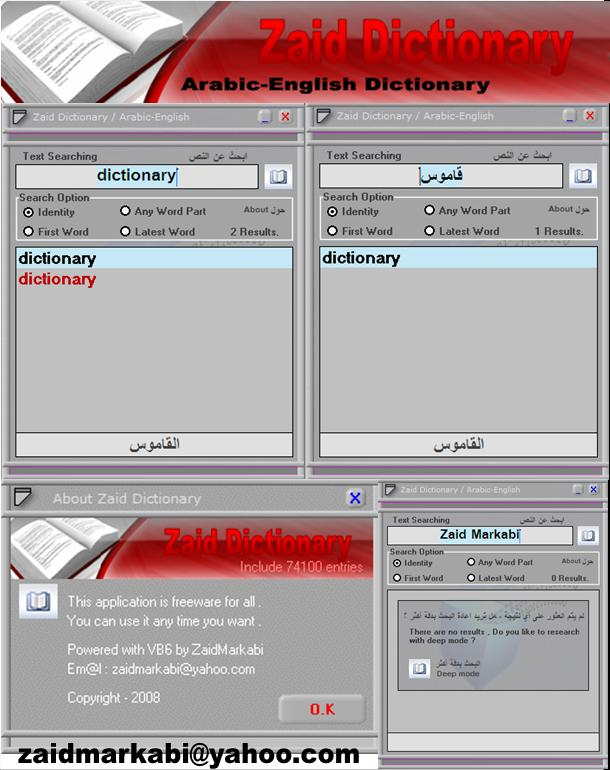



## ZaidDictionary Arabic\-English

### Description

Complete Dictionary between English&lt;&gt;Arabic with both direction , Include 74100+ words. see screenshot and vote for me please..

It's include .MDB access file also. try it and vote for me please..

This dictionary include these words :

* American English

* British English

* Abbreviations

* Acronyms

* Hyphenations

* Inflections

* Names

* Phrases

Total words : 74,000+ entries.

Em@il : zaidmarkabi@yahoo.com

I hope to hear from you soon ,

Zaid Markabi.
 
### More Info
 

             |
---                |---
**Submitted On**   |2008-09-26 10:26:12
**By**             |[Zaid Markabi](https://github.com/Planet-Source-Code/PSCIndex/blob/master/ByAuthor/zaid-markabi.md)
**Level**          |Advanced
**User Rating**    |5.0 (10 globes from 2 users)
**Compatibility**  |VB 5\.0, VB 6\.0
**Category**       |[Complete Applications](https://github.com/Planet-Source-Code/PSCIndex/blob/master/ByCategory/complete-applications__1-27.md)
**World**          |[Visual Basic](https://github.com/Planet-Source-Code/PSCIndex/blob/master/ByWorld/visual-basic.md)
**Archive File**   |[ZaidDictio2128339262008\.zip](https://github.com/Planet-Source-Code/zaid-markabi-zaiddictionary-arabic-english__1-71129/archive/master.zip)

